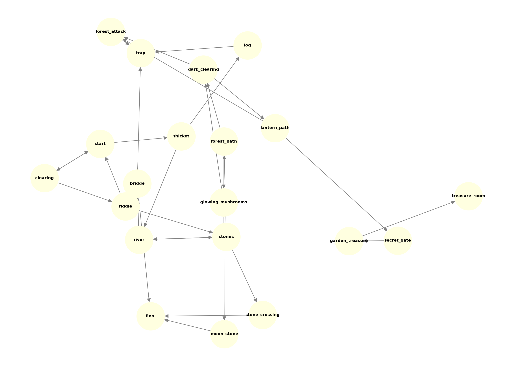

Here’s your updated **README.md** with the DFS map image embedded in the “Game Map” section.

---

# 🗺️ DFS Adventure Game – Find the Legendary Treasure

A **text-based adventure game** where you navigate through the **Whispering Woods**, face riddles, avoid traps, collect items, and use your wit to find the **legendary treasure**.
The game uses a **Depth-First Search (DFS) backtracking approach** to explore different paths, ensuring replayability and multiple possible outcomes.

---

## 📖 Story

You are an adventurer at the start of the year, standing at the edge of the **Whispering Woods**.
Your goal: **Find the legendary treasure** hidden deep in the forest.

Along the way, you will:

* Choose between branching paths.
* Solve riddles from mysterious guardians.
* Collect items to aid your journey.
* Survive traps, wild creatures, and unexpected dangers.

One wrong turn could lead to injury, getting lost… or worse. But choose wisely, and you may triumph!

---

## ⚙️ Features

* **DFS Algorithm** for path exploration and backtracking.
* **Branching storylines** with multiple endings.
* **Inventory system** to store items like the lantern.
* **Health system** – lose health when hurt; game over if it drops to zero.
* **Random chance events** for added unpredictability.
* **Replayability** – every playthrough can be different depending on choices.

---

## 🖥️ How to Play

1. **Clone the repository**

```bash
git clone https://github.com/your-username/dfs-adventure-game.git
cd dfs-adventure-game
```

2. **Run the game**

```bash
python adventure_game.py
```

3. **Game rules**:

   * You must be **at least 18 years old** to play (age is verified at the start).
   * Navigate using the available choices displayed at each scene.
   * Some scenes require **specific inventory items** to progress.
   * Health starts at **10 points** – falling into traps or losing fights will reduce it.

---

## 🗺️ Game Map (DFS Paths)

Below is the full **DFS traversal map** of the game’s scenes:



---

## 🧠 Algorithm

The game uses a **Depth-First Search (DFS)** style traversal:

* **DFS Backtracking**: The game recursively explores each path (scene), going as deep as possible before backtracking when a dead end or failure occurs.
* **Randomized Outcomes**: Certain paths (like crossing stones or fighting bandits) use random probabilities for success/failure.

Example traversal:

```
start → thicket → river → bridge → final (win)
start → clearing → riddle (wrong) → start → ...
```

---

## 📂 File Structure

```
📁 dfs-adventure-game
│── adventure_game.py        # Main game script
│── dfs_adventure_game_map.png # DFS flowchart of game paths
│── README.md                 # Game documentation
```

---

## 🛠️ Requirements

* Python **3.7+**
* No external dependencies (uses built-in Python libraries)

---

## 🎯 Future Improvements

* Add **save/load system** to continue where you left off.
* Implement **BFS version** for shortest-path gameplay.
* Add more **branching storylines** and special items.
* Create a **GUI version** for a visual experience.

---

## 📜 License

This project is licensed under the MIT License – feel free to fork and modify it.

---

## 🏆 Author

Developed by Bharath Kumar Vuyyuru – inspired by classic text adventures and DFS pathfinding concepts.

